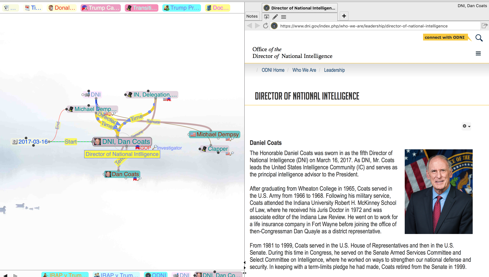
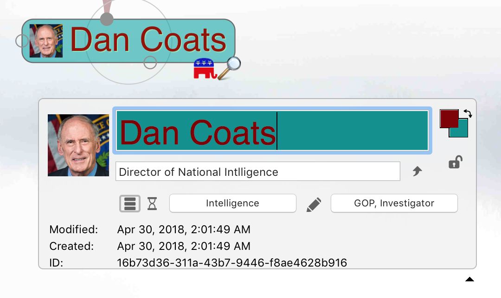
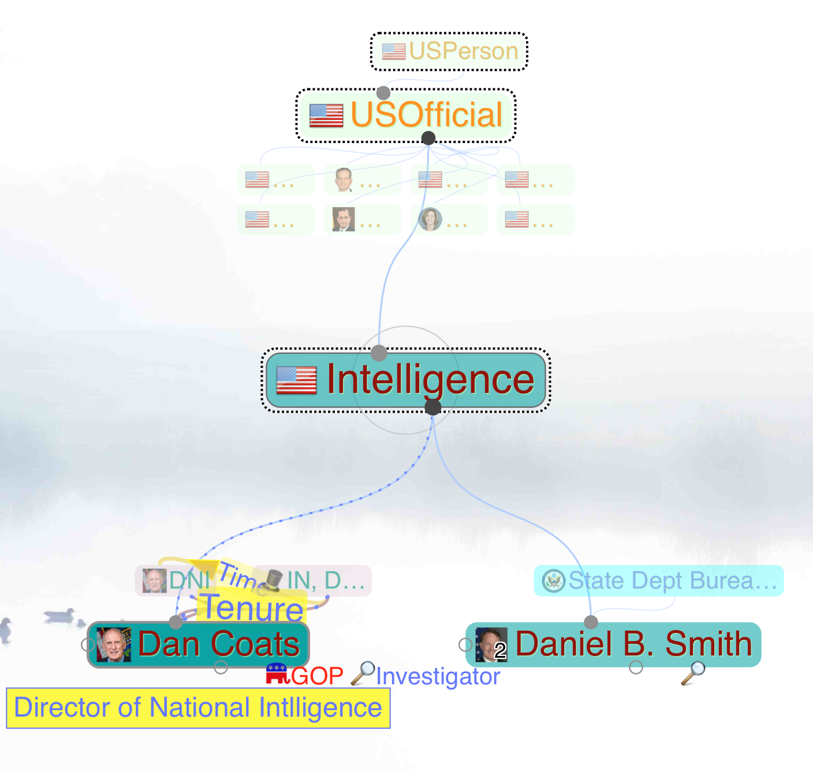

TheBrain Data Access
====================

This describes the data as exported into a zip file, with the sqlite3 data exported as json files.

____
File Organization
----
Within the zip file, are a collection of subdirectories named with node and link IDs, and at top level,
the following items:

| File / Directory      | File          | File       | Purpose
|-----------------------|---------------|------------|-----------------------------------------------------------------
| meta.json             |               |            | Contains the ExchangeFormatVersion (currently 4) and a 1 bit for thoughts with attachments?
| thoughts.json         |               |            | The [Node](modules/_src_index_d_.html#node) data
| links.json            |               |            | The [Link](modules/_src_index_d_.html#link) data
| settings.json         |               |            | Various opaque settings for the brain. The initial node is indicated by [ID_SETTING_INIT]{@link module:brain.ID_SETTING_INIT}
| attachments.json      |               |            | Metadata about each attachment
| modificationlogs.json |               |            | History and undo
| brainusers.json       |               |            | Username, email, first, last
| syncpoints.json       |               |            | History of synchronizations with the cloud server
| tombstones.json       |               |            | Shares IDs with modificationlogs, adds timestamp and typecode.
| calendarevents.json   |               |            | Information about TheBrain event items, and sync with external calendars
| access.json           |               |            | Presumably, information about sharing?
| _brainID/_            | wallpaper.png |            | Wallpaper image displayed behind the graph
|                       |               |            | Wallpaper image displayed behind the graph
| _node or link ID/_    |               |            | For nodes or links with attachments, including notes and custom icons
|                       | _attachment_  |            | File attachment (e.g. pdf, html)
|                       | .data/        |
|                       | .data/        | Icon.png   | Attached icon
|                       | notes/        |
|                       |               | notes.html | If notes are attached, an HTML fragment. Images, etc. are also located in this directory
____
# Data Model

TheBrain data model consists of [Node](modules/_src_index_d_.html#node) , [Links](modules/_src_index_d_.html#link), and attachments.

The user model has typed links between the regular nodes (called "Thoughts"). In the user interface, each node has
three attachment points, or "gates".

 The gates at the top and bottom are for hierarchical linking. Each bottom gate connects to top gates on other nodes.

If you draw a family tree, you'd have a link from each the
bottom gate on each parent, to the top gate on each child. These always go from parent to child, though they may be
displayed either without a direction arrow, or with it reversed. The parent is always displayed above the child.

The gate on the side ("jump gate") is for non-hierarchical links. Any side gate can be connected to any other
side gate, in either direction. There is always a direction, but it is not shown by default. As for links in the
hierarchy, the side gates can show their direction reversed from the underlying direction.

In the data model, however, there are no gates. Rather, links are classed into hierarchical and non-hierarchical
(among other attributes) by way of the [Relation:](enums/_src_index_d_.relation.html) field.
The user interface also provides tags, names and labels for nodes, labels for links, and attachments, as can be seen
in the following screenshot.

The nodes arrayed along the top of the screen are called "pins", and provide quick access to a few selected nodes.
We will discuss them more later, as they are part of the data model.

The nodes along the bottom are breadcrumbs, are per-session, so not part of the data model.

The main data consists of:
* [Node]{@link module:brain.Node} data, including user visible nodes, types, tags etc.
* [Link]{@link module:brain.Link} data connecting the various nodes

All objects in the data model are identified by an Id in the form of a [UUID]{@link module:brain.UUID} string.
Each instance of a TheBrain collection ("brain") is identified with a [UUID]{@link module:brain.UUID} in the
BrainId field.

## [Node](modules/_src_index_d_.html#node) Details

Nodes have a number of attributes, which can be seen here:

* In the upper left, we have an icon (a kind of attachment).
* A name ("Dan Coats"). This is how the node is normally displayed (abbreviated if necessary).
* A label ("Director of National Intelligence"). This is presented in hovers, can be searched, etc.
* Foreground and background colors for displaying th node. (These may be inherited from the type).
* A lock/unlock icon, denoting whether it is public or private.
* A node type ("Intelligence"). This is represented as a separate node.
* The two icons to the left bring up a menu, and edit history for this node.
* The edit button to the right takes you to edit the type node ("Intelligence", in this case).
* "GOP, Investigator" are a list of tags. These are actually separate nodes, specially linked.
* These are typically displayed as icons or small text on the lower right of the node.
* Modification and Creation timestamps.
* The ID of the node.
____
## [Link](modules/_src_index_d_.html#link) Details

Links always have a direction, from "ThoughtA" to "ThoughtB". They can be displayed without a direction, or with the
direction reversed.

Unlike nodes, they only have a Name: field, not a Label: field. The Name: field is displayed as a label on the arc,
if present. If not, if the link has a type, the type is used, or no label is drawn.

Links may have a color, used for drawing the line.
In addition to the links between user nodes, links are used behind the scenes for connecting to node types, denoting
the type hierarchy, and pinned.

Valid combinations of flags on [Links](modules/_src_index_d_.html#link):

|[Meaning:]{@link module:brain.Link.MEANING}|label    |[Kind]{@link module:brain~KIND}|[Relation]{@link module:brain.Link.RELATION}|Direction  |reverse|
|:-----------------------------------------:|:-------:|-------------------------------|--------------------------------------------|-----------|-------|
|0 (MEANING.PROTO)                          |_PROTO   |2 (KIND.TYPE)                  |0 (PROTO)                                   |-1,5,8,9   |false  |
|1 (MEANING.NORMAL)                         |_<user\>_|1 (KIND.LINK)                  |1 (HIERARCHY) 3 (JUMP)                   |-1,5,8,9,11|false  |
|2 (MEANING.MEMBER)                         |_TYPE    |2 (KIND.TYPE)                  |1 (HIERARCHY)                               | -1        |true   |
|3 (MEANING.SUBTYPE)                        |_SUPER   |1 (KIND.LINK)                  |1 (HIERARCHY)                               | -1        |true   |
|5 (MEANING.TAG)                            |_TAG     |1 (KIND.LINK)                  |1 (HIERARCHY)                               | -1        |true   |
|6 (MEANING.PIN)                            |_PIN     |1 (KIND.LINK)                  |1 (HIERARCHY)                               | -1        |false  |

Here, the "label" column refers to a label we apply for this case, not the Label: field in the brain node data.

____
## Node Types

User nodes ("thoughts") are typed, with the type being represented by a type node, which in turn are arranged
in a hierarchy.

Here, "Intelligence", "USOfficial", and "USPerson" are type nodes; "Dan Coats" is a "thought" or regular node.

The Intelligence type links to "Dan Coats" by a [MEANING.MEMBER]{@link module:brain.Link.MEANING} link, extending
from type to instance.

Similarly, each super type links to each of its subtypes. (This is the reverse of most object-oriented systems).
These links are tagged with [MEANING.SUBTYPE]{@link module:brain.Link.MEANING}.

Each typed node has a TypeId: field. This is the same information that can be found by following the
[MEANING.MEMBER]{@link module:brain.Link.MEANING} link back to the type. However, it is easier and faster to look up
an ID, and consistent with how link types are found (links do not have type nodes, but rather prototype links).
____
## Tags

Tags are represented as nodes, with a link from the tag to each node tagged wih that node.

The Tag nodes have a [Kind:](modules/_src_index_d_.html#node).{@link module:brain~KIND} field set to
[KIND.TAG]{@link module:brain~KIND}, but they are otherwise ordinary nodes.

Each tag is linked to each node having that tag (as opposed to the other way around). As you can see, there can be
a very large number of links from each tag. Each node has a TagIds: field, but it is always an empty array.

____
## Pins

Pins are denoted by linking from a singleton node named "Pinned", with Kind: [KIND.SPECIAL]{@link module:brain~KIND},
and a link with Meaning: [MEANING.PIN]{@link module:brain.Link.MEANING}.
> Note: These names are the arbitrary result of reverse engineering of the data. Both could be SPECIAL or both PIN,
> depending on how TheBrain chooses to evolve.
____
____